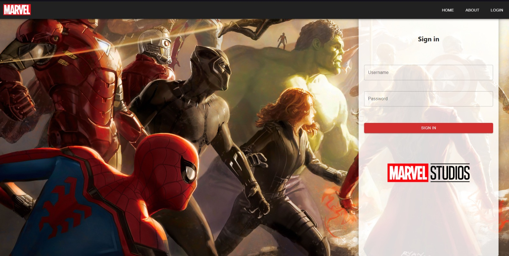
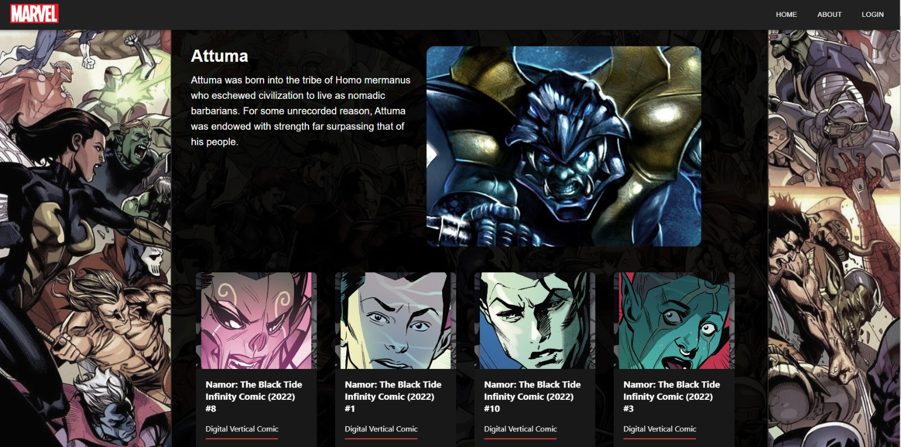
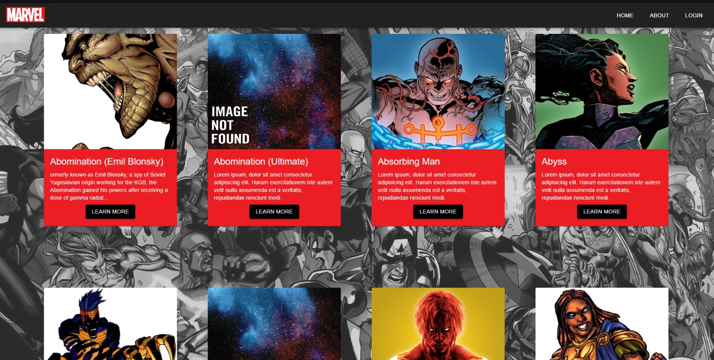

# Marvel App

Marvel App es una App creada con Javascript, React y Material UI en el Front y consumiendo una Api para mostrar los Datos de los distintos personajes de Marvel.
La App cuenta con un Login, un Home para seleccionar un personaje y una seccion para mostrar los Detalles del personaje

## Imagenes

  

  

  

##  Para Comenzar

 1. Clonar el repositorio
 2. Realizar comando `npm install` en la carpeta raiz
 3. Ejecutar comando `npm start` para levantar la pagina
 4. Disfrutar de Marvel App.
